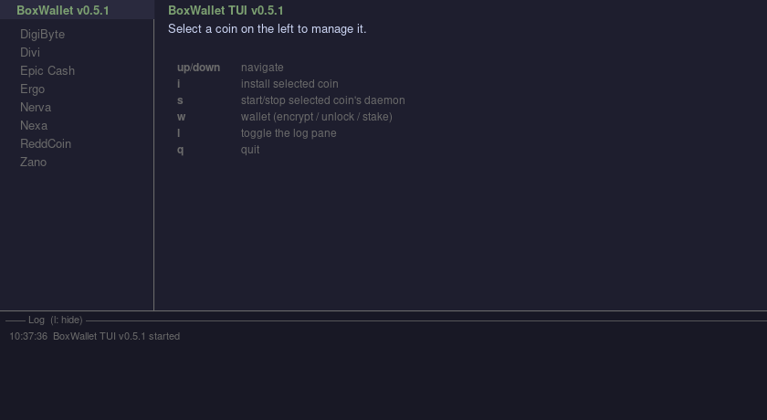
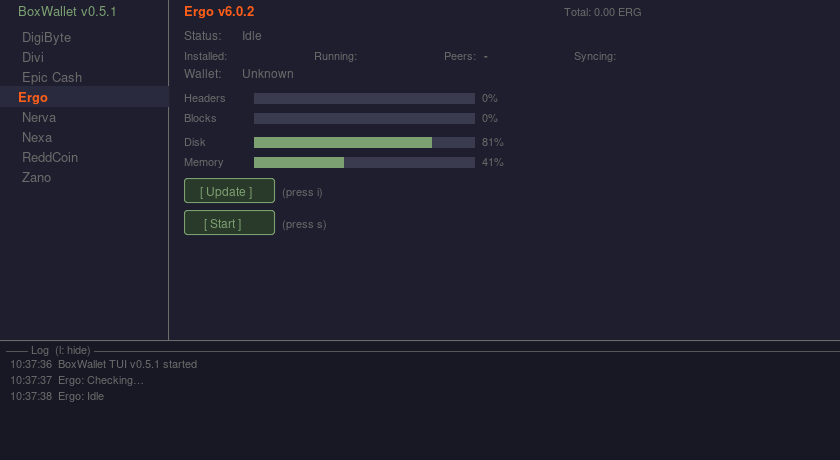

# BoxWallet

A terminal-based cryptocurrency wallet manager. Install, start, and monitor coin
daemons from a single TUI — no browser, no Electron, no cloud.



## Supported coins

| Coin | Abbrev |
|------|--------|
| Bitcoin | BTC |
| DigiByte | DGB |
| Divi | DIVI |
| Epic Cash | EPIC |
| Ergo | ERG |
| Litecoin | LTC |
| Nerva | XNV |
| Nexa | NEXA |
| ReddCoin | RDD |
| Salvium | SAL |
| SpiderByte | SPB |
| Zano | ZANO |

DigiByte includes a **DigiDollar** tab (DigiByte core v9.26+): mint DD against
locked DGB collateral at a chosen lock tier, send/receive DD, watch the oracle
DGB/USD price and system health, and redeem vaults once their timelock expires.
The tab tracks the on-chain BIP9 deployment — before the mainnet activation
height it counts down to the activation block, and the mint/send/redeem
actions unlock automatically the moment the chain reaches it.

## Install

Download the latest binary for your platform from the
[Releases](https://codeberg.org/richardltc/BoxWallet/releases) page and run it —
no install step needed.

| Platform | File |
|----------|------|
| Linux x86_64 | `boxwallet-linux-x86_64` |
| Linux aarch64 | `boxwallet-linux-aarch64` |
| macOS x86_64 | `boxwallet-macos-x86_64` |
| macOS Apple Silicon | `boxwallet-macos-aarch64` |
| Windows x86_64 | `boxwallet-windows-x86_64.exe` |

Linux and macOS binaries are statically linked (musl) — they run on any
distribution without library dependencies. Each release ships a `SHA256SUMS`
file; verify with `sha256sum -c SHA256SUMS`.

BoxWallet keeps coin daemons under `~/.boxwallet/` (Windows:
`%USERPROFILE%\AppData\Roaming\BoxWallet\`). The binary itself can live anywhere.

## Usage

```sh
./boxwallet-linux-x86_64   # launch the TUI
```

Navigate with the keyboard:

| Key | Action |
|-----|--------|
| `↑` / `↓` or `j` / `k` | Move through the coin list |
| `i` | Install (or update) the selected coin's daemon |
| `s` | Start / stop the daemon |
| `w` | Wallet — encrypt, unlock, or check stake |
| `l` | Toggle the log pane |
| `q` | Quit |

Select a coin to see its detail pane with live daemon status, sync progress, and
disk/memory usage:



## Auto-update

BoxWallet updates itself in-app. While running, a background worker checks for a
newer release and downloads it. On next launch the new binary is swapped in
automatically — no package manager, no manual download.

If BoxWallet is in a location you can't write (e.g. `/usr/local/bin` run as a
regular user), the swap can't happen; the Home pane explains why.

## Build from source

Requires [Zig 0.16](https://ziglang.org/download/).

```sh
git clone https://codeberg.org/richardltc/BoxWallet.git
cd BoxWallet
ZIG_GLOBAL_CACHE_DIR=zig-pkg zig build run     # launch the TUI
ZIG_GLOBAL_CACHE_DIR=zig-pkg zig build test    # run offline unit tests
ZIG_GLOBAL_CACHE_DIR=zig-pkg zig build release # cross-compile all release binaries
```

`ZIG_GLOBAL_CACHE_DIR=zig-pkg` points the build at the vendored
[ZigZag](https://github.com/meszmate/zigzag) dependency for a fully offline,
reproducible build.
