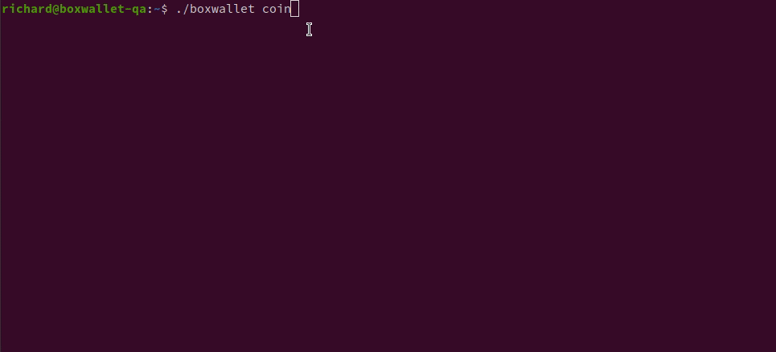

# What is BoxWallet? #

BoxWallet is a single binary multi-coin CLI tool, that gets your coin-of-choice wallet/node set-up ***fast***, with just a few commands:

`./boxwallet coin` - allows you to choose your coin of choice, which then downloads the project's core files from their official website, and installs them automatically.

`./boxwallet start` - starts the coin's daemon, which syncs the Blockchain.

`./boxwallet dash` - displays a dashboard with the coins Blockchain and wallet info.

## What are some of BoxWallet's features? ##

* Install and run a CLI node or wallet simply, by using two commands: `coin`, to choose your coin and `start` to start the syncing.
* Easily keep up-to-date with the latest version of BoxWallet by using the separate `bwupdater` app.
* Setting up multiple nodes/staking wallets on a single machine, and easily switch between them using the `coin` command.
* Viewing your wallet/node that might be running on a Raspberry Pi, from another computer such as Linux, Mac or Windows.
* Displaying the staking status of your wallet. 
* Displaying blockchain and master node syncing status.
* Displaying of block count and network difficulty.
* Displaying of % coins required for staking. (for DIVI)
* Auto fixing common wallet issues, which can be common after power failures.
* Balance in your coin, USD, AUD and GBP (more coming soon...)

## What coins does BoxWallet currently support?

* BitcoinPlus
* Denarius
* DeVault
* DigiByte
* Divi
* Groestlcoin
* Feathercoin
* Peercoin
* Phore
* PIVX
* Rapids
* ReddCoin
* Scala (coming soon)
* Trezarcoin
* Vertcoin

## How can I install BoxWallet?

### Windows

Download the file `boxwallet_XXX_Windows_64bit.zip` where `XXX` represents the latest version number.
Extract the files, open a command prompt, then run `boxwallet coin`

### Linux

I'm going to assume that you've got a basic CLI Linux installation, and have SSH access.

Go to the page: `https://github.com/richardltc/boxwallet/releases/latest` and find the correct Linux file for your platform.
If you are running normal Linux, you'll almost certainly want the file ending in `Linux_64bit.tar.gz`
However, if you're running on a Raspberry Pi, you'll probably want the file ending in `Linux_arm32bit.tar.gz` unless you're running a 64bit OS, in which case, you'll need the file ending in `Linux_arm64.tar.gz
`

In your browser, right click on the correct file you need and choose "copy link", then, in your Linux terminal, type `wget ` then paste the link after it.

If the version of BoxWallet was `0.41.1` you should now have a line of text that looks like the following:

`wget https://github.com/richardltc/boxwallet/releases/download/0.41.1/boxwallet_0.41.1_Linux_64bit.tar.gz`

Press return, and the command `wget` should now download that file to you current directory.

Next, enter the command:

`tar -xf ./boxwallet` then, without a space, press the tab key to auto-complete the command line.
You should then have a line that says:

`tar -xf ./boxwallet_0.41.1_Linux_64bit.tar.gz`

Press return, and you should then have the following files:

`boxwallet` - The BoxWallet application.

`bwupdater` - The tool that you can run, to keep BoxWallet up-to-date.

`README.md` - This file.

### How do I run? ###

Download BoxWallet, for your platform of choice, from the releases page, extract the files to a location of your choosing and then run `./boxwallet coin`.
 
This will download the official binaries from the coin's project website, and install them automatically for you.

Then run `./boxwallet start`, to start the coin's daemon server. 

Then  `./boxwallet dash`, where you will be greeted with an initial wizard to get you going, followed by a dashboard.

### OK, but what else can BoxWallet do? ###

* Creates an initial wallet from scratch, for the coin of your choosing.

* Takes you through an initial wizard to ensure your wallet is secure.

* `boxwallet coin` - Installs the official coin project CLI files, and creates a new wallet.

* `boxwallet dash` - Displays blockchain, syncing, staking and coin balance and AUD/USD/GBP (Divi only) balance info.

* `boxwallet send` - Send your crypto.

* `boxwallet wallet backup` - Creates a backup of your `wallet.dat` file, based on today's dates, and names it based on the days date.

* `boxwallet wallet encrypt/unlock/unlockfs` - Allows the encryption and unlocking of the wallet for safe staking.

* `boxwallet wallet displayaddress` - Displays your public coin address.

* `boxwallet wallet reindex` - re-indexes your local copy of the Blockchain

* `boxwallet wallet resync` - Performs a complete, from scratch, resync of the Blockchain.

* Allows you to "web enable" your existing wallet (coming soon).

## Is BoxWallet free? ##

Yes! BoxWallet is FREE to use, however, if you'd like to send a tip, please feel free:

DIVI: DSniZmeSr62wiQXzooWk7XN4wospZdqePt

## Thank you for trying and supporting BoxWallet